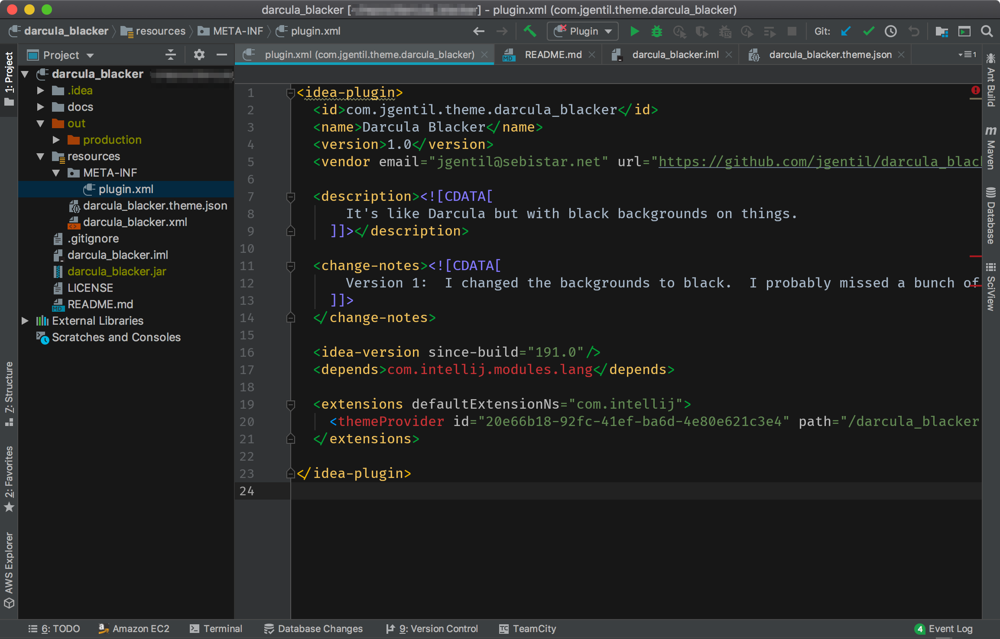

# Darcula (blacker)
Jetbrains IDE plugin that extends the Darcula UI Theme to have black backgrounds in certain areas.

#### What needs to be done still?
Probably a lot of things.  This is a work in progress.  I'll release it to the plugin repository eventually.

#### What *isn't* going to be done?
Litearlly anything else.  I'm not making a custom editor theme.  You can use your own.  It's only bundled with one that
slightly modifies the Darcula editor theme just to make it's background black as well.

Also, clever people will notice that it's ever so slightly not black.  It just looks better.  Sorry not sorry.

#### Screenshot
Because people who make themes without screenshots are bad people.

 

Loosely inspired by the [ColorIde](https://github.com/dmalch/ColorIde) plugin by @dmalch (that I desperately held onto 
for so long after it's deprecation until custom theme support was implemented in 2019.1) and a less extreme version of the 
[jake-theme](https://github.com/jakecoffman/jake-theme) by @jakecoffman.
 
